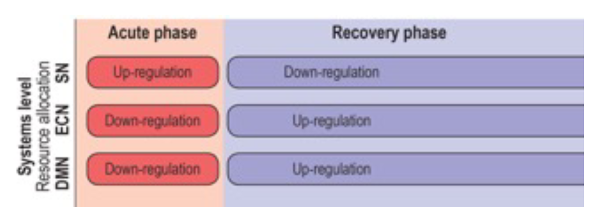
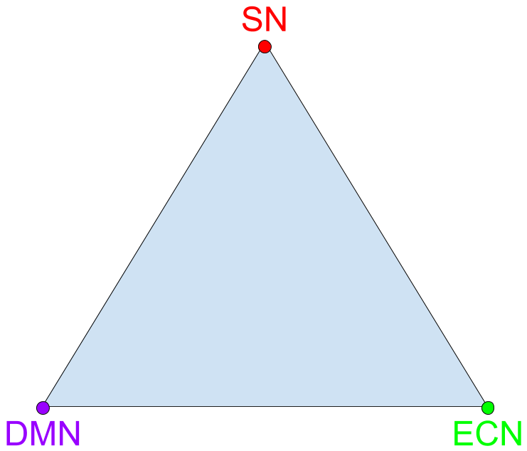

# STRESNET WP5

## Neurofeedback training based on global network shifts to increase stress resiliance

+++

### WP5.1

**Establish reliablity of neurofeedback signal by demonstrating that individuals can:**
  1. gain general control over this measure
  2. receive significantly more information from this than from a verbal instruction
  3. use this information to counteract an externally induced brain response
  4. after training, apply this learned mechanism in the absence of feedback

+++

### WP5.2

**Hypothesis**:

Neurofeedback training based global network shifts lowers stress reactivity in a laboratory test outside of the scanner

+++

### WP5.3

**Hypothesis**:

Post-neurofeedback training benefits generalize to real-world outcomes in terms of increasing stress resilience

---

## What neurofeedback signal?

+++

### My initial intuition
**Develop sophisticated connectivity measure:**
  - identify representative areas for each of the three core networks
  - compute some measure that captures their activation relative to each other (e.g. between-network cohesion; Young et al. 2017)

+++

### Erno's original plan
**Develop algorithm  sensitive  to  individual  “fingerprints”  of  neural  responses  to  stressors:**
  - train classifier on individual patterns of neural activity elicited in response to brief stressor, known to trigger rapid shift towards salience network
  - use resulting set of weights to combine activity patterns measured in real-time (in response to the same challenge) into a single score expressing the similarity of the current brain state to the training state

---

## Requirements for NF signal

+++

1. **Conceptual**
  - capture the "right thing"

2. **Technical**
  - definable in reasonable amount of time
  - computable in real-time

3. **Emprical**
  - sufficent information (SNR)
  - "controllable"

+++

### What is our goal?

**Train participants to shift from global state A of three large-scale networks to some other global state B**

+++

### How to suffficiently capture A?

- **Function**
  - SN > Baseline
  - SN > ECN
  - SN > DMN
  - SN > DMN+ECN
  - some other configuration of SN, ECN and DMN

- **Detail**
  - specific region(s)
  - global

+++

### What is B?

- not A
- ECN > SN
- DMN > SN
- ECN+DMN > SN
- a perfect balance between SN, ECN and DMN
- some other configuration of SN, ECN and DMN

---

## Relevant rtfMRI-NF studies

++++?image=images/CAN_NF_Studies.png&size=contain

+++?image=images/Hamilton_2016.png&size=55% 90%

+++?image=images/Veit_2012.png&size=contain

+++?image=images/Paret_2016.png&size=contain

+++?image=images/Nicholson_2017.png&size=57% 100%

+++?image=images/Scheinost_2013.png&size=55% 55%

+++?image=images/Sarkheil_2015.png&size=55% 45%

+++?image=images/Kadosh_2017.png&size=55% 90%

+++?image=images/Zhang_2015.png&size=55% 80%

+++?image=images/Zilverstand_2015.png&size=55% 90%

+++?image=images/Koush_2017.png&size=55% 90%

+++?image=images/Moll_2014.png&size=70% 100%

+++?image=images/Li_2016.png&size=55% 100%

---

## "Labdemo" dataset

+++

- Fear conditioning paradigm:
  - 15 CS+ (4 sec)
  - 15 CS- (4 sec)
  - 6 UCS

- Parameters:
  - 319 volumes
  - 2.4 mm isotropic
  - 60 slices
  - TR = 0.867
  - ~ 4.5 min

+++

### Disclaimer

- Very short recording --> few trials
- Resliced to 3 mm isotropic
- Events resampled to TR resolution

+++

### Univariate results

- CS+ > CS-

+++?image=images/labdemo_univariate.png&size=auto 90%

+++

### SVM

- Single-trial modeling (HRF -1 to +6)
- Split into training set (n=10) and test set (n=5)
- Train (linear kernel, model selection using cross-validation with 10 folds)
- Permutation-based validation of classifier accuracy (i=200)

+++?image=images/labdemo_svm.png&size=auto 90%

+++

### Recursive Feature Elimination

- Full-brain mask
- Use training data from before
- Nested two-level cross-validation:
  - First level (4 folds): univariate feature-selection (top 33%)
  - Second level (4 folds): SVM performance feature-selection (10 iterations; keep 20%)

+++?image=images/labdemo_rfe_generalization.png&size=auto 90%

+++?image=images/labdemo_rfe.png&size=auto 90%

+++

- Permutation-based validation of classifier accuracy (i=200)

+++?image=images/labdemo_rfe_svm.png&size=auto 90%

---

## An ambitious idea

+++

**Train participants to shift from global state A of three large-scale networks to another global state that is not A, but B and/or C**

+++

- Use multi-class SVM to capture these three "brain states"
  - A = Shift in balance towards SN
  - B = Shift in balance towards ECN
  - C = Shift in balance towards DMN

+++

+++

- Design Localiser with three trial types:
  - SN activation (threat)
  - ENC activation (n-back)
  - DMN activation (rest?)

- Train SVM to distinguish between them

- NF signal is postion in 2D space of "brain states"

+++

